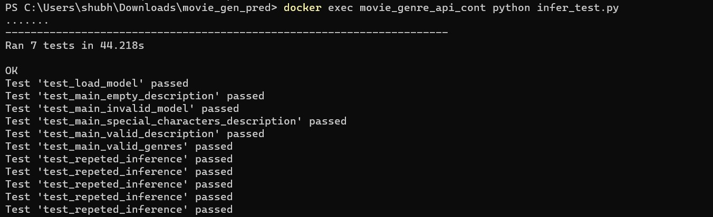

# Movie Genre API

This repository contains code for a Movie Genre API that predicts the genre of a movie based on its description. Initial analysis and model building is performed in the model_building.ipynb file. A bert based transformer architecture is used to train the model for multilabel prediction. The trained model generated from this file is further used in the api service.

A simple html interface to interact with API is also provided, which will run on 127.0.0.1:8000


## Prerequisites

The service will automatically download the trained model from a google drive link if it's not already available.

## Docker Setup

To create a Docker container for the API, follow these steps:

1. Open a terminal or command prompt.
2. Navigate to the directory containing the Dockerfile.
3. Build the Docker image using the following command:

   ```
   docker build --tag movie_genre_api_image --build-arg container_name=movie_genre_api_cont .

   ```


## Running the API Server

To run the API server inside a Docker container, use the following command:

```
docker run --name movie_genre_api_cont -p 8000:8000 movie_genre_api_image
```

The API server will start and listen on port 8000.


## Running the API Tests

To run the API Tests inside a Docker container, use the following command:

```
docker exec movie_genre_api_cont python api_test.py
```


## Running the Inference Model Tests

To run the Tests for Inference Model inside a Docker container, use the following command:

```
docker exec movie_genre_api_cont python infer_test.py
```



## Making API Requests

You can use the following `curl` command to get the genre of a movie by providing its description:

```
docker exec movie_genre_api_cont curl -X POST -d 'description=A movie about 5 comedians who are on a trip to Las Vegas and they get  involved in killing of a person' http://127.0.0.1:8000/analyze
```
Note that we can get multilabel response depanding on the description provided


## Error Handeling API Requests

Various helpful error messages are provided depending on the error in the request, like wrong endpoint, required argument 'description' not available etc:

```
docker exec movie_genre_api_cont curl -X POST -d 'mydescription=A movie about 5 comedians who are on a trip to Las Vegas and they get  involved in killing of a person' http://127.0.0.1:8000/analyze
```
Note that we get error message when we run the above curl request


## Web Interface

A web interface running on 127.0.0.1:8000 is also provided, which can help in quick testing:


Error handelling in web


Make sure to replace `127.0.0.1:8000` with the appropriate address if running the API server on a different machine.

The response will contain the predicted genre of the movie.
